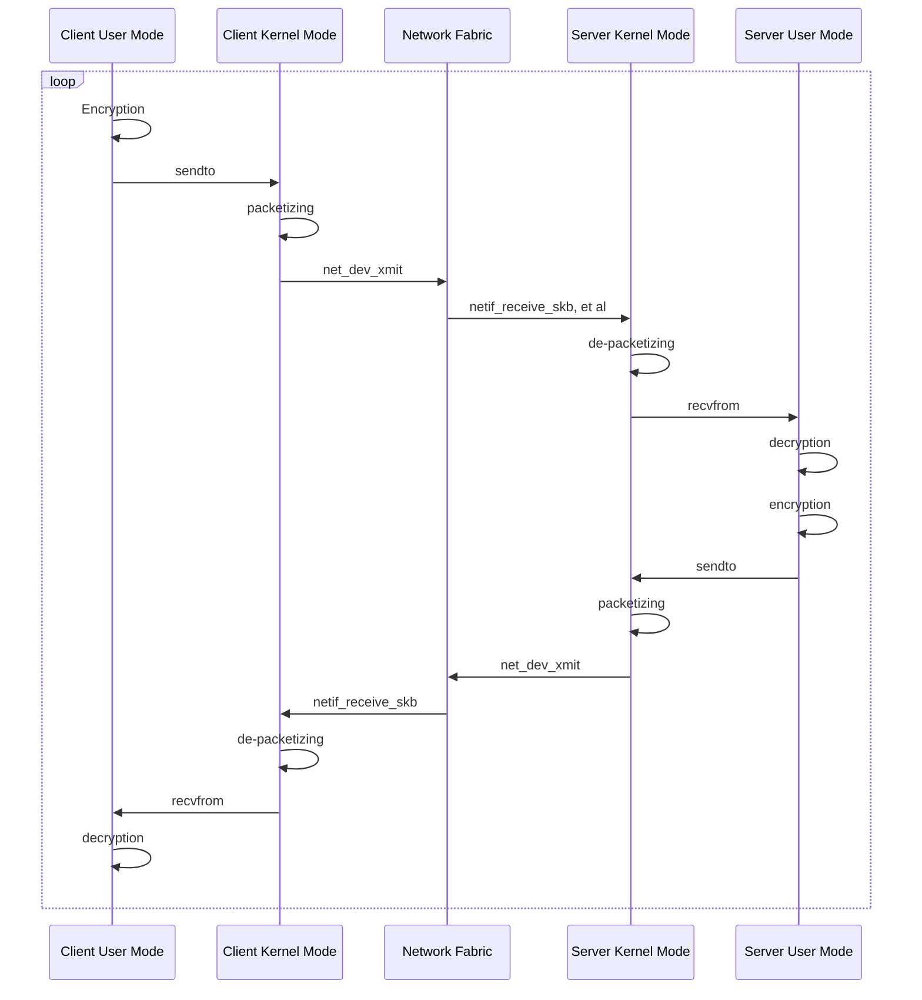
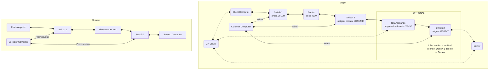

## illinoisrobert.github.io

```mermaid
sequenceDiagram
    participant cu as Client User Mode
    participant ck as Client Kernel Mode
    participant nf as Network Fabric
    participant sk as Server Kernel Mode
    participant su as Server User Mode

    loop
        cu ->> cu: Encryption
        cu ->> ck: sendto
        ck ->> ck: packetizing 
        ck ->> nf: net_dev_xmit
        nf ->> sk: netif_receive_skb, et al
        sk ->> sk: de-packetizing
        sk ->> su: recvfrom
        su ->> su: decryption
        su ->> su: encryption
        su ->> sk: sendto
        sk ->> sk: packetizing
        sk ->> nf: net_dev_xmit
        nf ->> ck: netif_receive_skb
        ck ->> ck: de-packetizing
        ck ->> cu: recvfrom
        cu ->> cu: decryption
    end
```

```mermaid
 
flowchart TD
  subgraph Logan
        client o--o lswitch1 o--o lrouter o--o lswitch2 o--o tls o--o lswitch3 o--o server
        ca("CA Server") o-.-o client & server & tls   
        lswitch2("Switch 2<br>netgear prosafe JGS524E")
        lswitch1("Switch 1<br/>aruba 3810m")
    subgraph OPTIONAL
        explain@{shape: text, label: "If this section is omitted, connect **Switch 2** directly to **Server**"}
        lswitch3("Switch 3<br/>netgear GS324T")
        tls("TLS Appliance<br/>progress loadmaster X3-NG")
    end
        server("Server")
        lrouter("Router<br/>cisco 4300")
        client("Client Computer")
    collector("Collector Computer") o-- Mirror --o lswitch1 & lswitch2 & lswitch3
  end
  subgraph Sharam
        computer1["First computer"] o--o sswitch1[Switch 1] o--o dut["device under test"] o--o sswitch2[Switch 2] o--o computer2["Second Computer"] 
    scollector("Collector Computer") o-- Promiscuous --o sswitch1 & sswitch2   
  end
```

