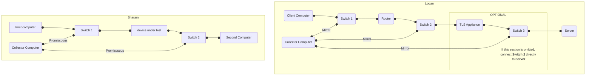

## illinoisrobert.github.io

```mermaid
flowchart TD
  subgraph Logan
        client o--o switch1 o--o router o--o switch2 o--o tls o--o switch3 o--o server
        switch2("Switch 2")
        switch1("Switch 1")
    subgraph OPTIONAL
        explain@{shape: text, label: "If this section is omitted, connect **Switch 2** directly to **Server**"}
        switch3("Switch 3")
        tls("TLS Appliance")
    end
        server("Server")
        router("Router")
        client("Client Computer")
    collector("Collector Computer") o-- Mirror --o switch1 & switch2 & switch3   
  end
  subgraph Sharam
        computer1["First computer"] o--o sswitch1[Switch 1] o--o dut["device under test"] o--o sswitch2[Switch 2] o--o computer2["Second Computer"] 
        switch3("Switch 3")
        switch2("Switch 2")
        switch1("Switch 1")
        server("Server")
        tls("TLS Appliance")
        router("Router")
        client("Client Computer")
    scollector("Collector Computer") o-- Promiscuous --o sswitch1 & sswitch2   
  end
```
