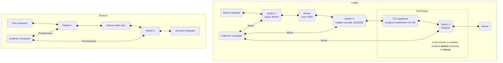

## illinoisrobert.github.io

```mermaid
flowchart TD
  subgraph Logan
        client o--o lswitch1 o--o lrouter o--o lswitch2 o--o tls o--o lswitch3 o--o server
        lswitch2("Switch 2<br>netgear prosafe JGS524E")
        lswitch1("Switch 1<br/>aruba 3810m")
    subgraph OPTIONAL
        explain@{shape: text, label: "If this section is omitted, connect **Switch 2** directly to **Server**"}
        lswitch3("Switch 3<br/>GS324T")
        tls("TLS Appliance<br/>progress loadmaster X3-NG")
    end
        server("Server")
        lrouter("Router<br/>cisco 4300")
        client("Client Computer")
    collector("Collector Computer") o-- Mirror --o lswitch1 & lswitch2 & lswitch3   
  end
  subgraph Sharam
        computer1["First computer"] o--o sswitch1[Switch 1] o--o dut["device under test"] o--o sswitch2[Switch 2] o--o computer2["Second Computer"] 
    scollector("Collector Computer") o-- Promiscuous --o sswitch1 & sswitch2   
  end
```
